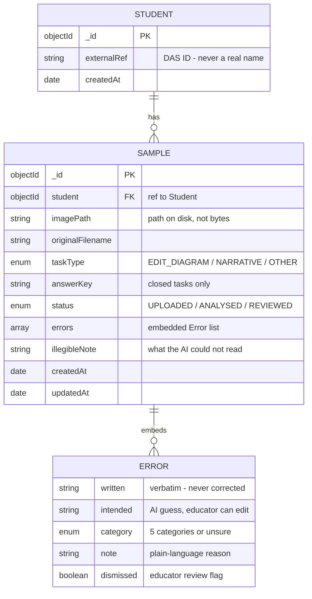

# LexiPath — Error Analysis module

LexiPath is a web app for the **Dyslexia Association of Singapore (DAS)** that
helps educators understand the spelling and writing mistakes made by children
with dyslexia. This repository contains its first working module: **Error
Analysis**. You upload a photo or scan of a child's handwritten work, an AI
reads it and flags the mistakes, and you review those mistakes side by side
with the original scan.

## The one idea that shapes everything

Children with dyslexia make mistakes like writing *"panishment"* for
*"punishment"* (spelling it the way it sounds) or reversing letters. Those
mistakes are **the whole point of this tool** — they are the data an educator
needs to understand how a child spells.

A normal handwriting reader (OCR) is useless here, because it silently
"corrects" those mistakes into real words, destroying exactly what we need.
So LexiPath works differently:

```
Upload image
     │
     ▼
Gemini (a vision AI) reads the image and returns the errors directly,
     │  in ONE call. For each error: the word as written, the intended
     │  word, a category, and a plain-language reason.
     ▼
HUMAN REVIEW: the educator sees the flagged errors NEXT TO the original
     │  scan, checks each one against the real handwriting, dismisses
     │  false alarms, and can correct a wrong "intended" guess.
     ▼
Results saved.
```

Why it's built this way:

- **The AI is instructed, at length, to preserve mistakes exactly.** Never
  auto-correcting is the core rule of the whole app — not in the prompt, not
  in the code, not in the UI.
- **One AI call per image** keeps things simple and, in testing, caught more
  of the phonetic, dyslexic-style spellings than a two-step pipeline.
- **A human stays in the loop.** The AI can misread messy handwriting or flag
  something that isn't really wrong, so the review screen puts the scan and
  the flagged errors side by side. The educator's dismissals and corrections
  are the final word — that is what makes the tool trustworthy.

The errors are sorted into a fixed vocabulary of five categories (plus
`unsure` when the AI can't confidently pick one):

| Category | Meaning | Example |
| --- | --- | --- |
| phonological | sounds right but spelled wrong | "panishment" → "punishment" |
| orthographic | letters wrong, swapped, or reversed | "form" → "from" |
| morphological | base word correct but ending/prefix wrong | "regreted" → "regretted" |
| capitalisation | a capital letter missing or wrong | "tom" → "Tom" |
| punctuation | a punctuation mark missing or wrong | "wont" → "won't" |

## Data model

Two MongoDB collections. The `ERROR` box below is not its own collection —
each error is embedded inside its sample's `errors` array, because a sample
is always processed end to end on its own.



## Folder structure

```
lexipath/
  client/                  # the React frontend (Vite + Tailwind)
    src/
      App.jsx              # decides which screen is visible
      api.js               # every call to the backend
      constants.js         # the categories, statuses and task types
      components/          # one file per screen or reusable piece
  server/                  # the Express backend
    index.js               # starts Express, connects to MongoDB
    config/config.js       # reads .env into one settings object
    config/db.js           # the Mongoose connection
    models/Student.js      # a child, identified only by DAS ID
    models/Sample.js       # one piece of work + its flagged errors
    routes/samples.js      # all five API endpoints
    services/gemini.js     # the single Gemini call + retry + parsing
    services/geminiPrompt.js  # the prompt text (the heart of the app)
    uploads/               # uploaded scans land here (git-ignored)
    .env                   # your secrets (git-ignored)
    .env.example           # template showing which secrets are needed
```

## Setup (step by step)

You need [Node.js](https://nodejs.org) 20 or newer installed.

### 1. Install the dependencies

Open a terminal in the project folder and run:

```bash
cd server
npm install
cd ../client
npm install
```

### 2. Get a free Gemini API key

1. Go to [Google AI Studio](https://aistudio.google.com/apikey) and sign in
   with a Google account.
2. Click **Create API key** and copy the key.

The free tier includes vision (reading images) and allows roughly 10 requests
per minute — plenty, since LexiPath makes one request per uploaded image. The
code retries automatically if the limit is hit.

### 3. Set up MongoDB

Either option works:

- **Locally:** install
  [MongoDB Community Server](https://www.mongodb.com/try/download/community)
  and let it run as a service. The default connection string
  `mongodb://127.0.0.1:27017/lexipath` will just work.
- **In the cloud (free):** create a free cluster at
  [MongoDB Atlas](https://www.mongodb.com/cloud/atlas), create a database
  user, and copy the connection string it gives you.

### 4. Fill in your secrets

Copy `server/.env.example` to `server/.env` and fill in the values:

```
GEMINI_API_KEY=your-real-key-here
GEMINI_MODEL=gemini-3-flash-preview
MONGODB_URI=mongodb://127.0.0.1:27017/lexipath
PORT=5000
```

`GEMINI_MODEL` must be a free-tier, vision-capable Flash model.
`gemini-3-flash-preview` works with newly created API keys (Google retires
older models for new keys — `gemini-2.5-flash` returns a 404 on keys made
after mid-2026). Check the
[model list](https://ai.google.dev/gemini-api/docs/models) if you want to try
a newer Flash model.

## Running the app

Use two terminals, one for each half:

```bash
# Terminal 1 - the backend
cd server
npm run dev        # -> LexiPath server listening on http://localhost:5000

# Terminal 2 - the frontend
cd client
npm run dev        # -> open http://localhost:5173 in your browser
```

The frontend dev server proxies API calls to the backend automatically, so
there is nothing else to configure.

To try it out: click **Upload a sample**, choose a scan (JPG, PNG or WebP),
enter the student's DAS ID, pick the task type, and press **Upload and
analyse**. After a few seconds the review screen appears — check each flagged
error against the scan, dismiss anything that isn't a genuine mistake, and
the review saves itself.

## How the code is organised (so you can learn from it)

Every file starts with a header comment explaining what it is for, and the
same patterns repeat everywhere — understand one route or one component and
you understand them all. Good places to start reading:

- **`server/services/geminiPrompt.js`** — the prompt is the soul of the app.
  Read it to understand what the AI is being asked to do, and why the wording
  insists so hard on preserving mistakes.
- **`server/services/gemini.js`** — how an image becomes base64, travels to
  the API, and comes back as JSON; how retries with exponential backoff
  handle the free tier's rate limit; how the AI's answer is checked before
  it is trusted.
- **`server/routes/samples.js`** — five endpoints, all the same shape:
  validate, do the work, return clear JSON, catch errors readably.
- **`server/models/Sample.js`** — what a Mongoose schema is, and how one
  document holds everything about a piece of work.
- **`client/src/App.jsx`** — how the three screens flow into each other with
  plain React state (no router needed).
- **`client/src/components/ReviewScreen.jsx`** — the centrepiece: the scan
  and the flagged errors side by side, and how the educator's dismissals and
  corrections are saved.

## Privacy

- Students are identified **only by their DAS ID** (e.g. "Student-60570").
  Real names are never stored.
- Uploaded scans stay on the local disk in `server/uploads/`, which is
  git-ignored along with `.env` — neither ever leaves the machine via git.

## Scope

This module deliberately does **only** error analysis. There are no user
accounts, no analytics dashboards, and no intervention recommendations —
those are separate future modules.
